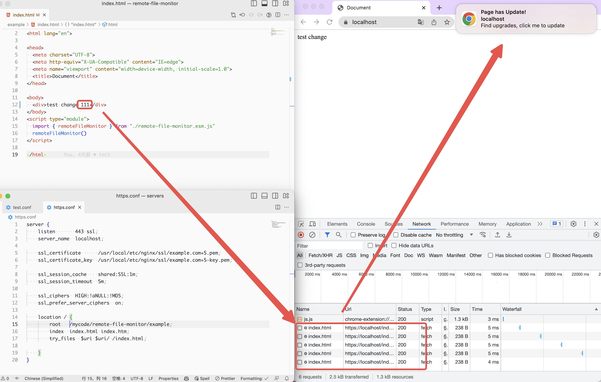

## 效果图


## 远程文件监控

此库用于监控远程文件是否发生更改，并在发生更改时通知用户刷新页面。

### 原理
借助浏览器的 **协商缓存** 的机制，通过 `Web Worker` 轮训检查入口文件，如果有更新则通过 `new Notification` 通知用户。
### 安装

使用npm安装远程文件监控库：

```bash
npm install remote-file-monitor
```


### 使用说明

首先，导入所需的模块和接口定义，**默认配置即可使用**：

```typescript
import { remoteFileMonitor } from 'remote-file-monitor';

remoteFileMonitor()
```

### 自定义参数示例

```typescript
import { remoteFileMonitor } from 'remote-file-monitor';

const config: WorkerConfig = {
   loopMs: 5000,
   checkFileUrl: 'https://example.com/index.html',
   enable: process.env.NODE_ENV !== 'development',
   clickCallback: () => {
     window.location.reload();
   },
   notification: {
     title: '页面已更新！',
     options: {
       dir: 'auto',
       body: '发现新的更新，请点击刷新页面',
       requireInteraction: true,
     },
   },
};

remoteFileMonitor(config);
```

这将在指定的时间间隔内检查远程文件是否更改，并在更改时发送通知。

### 配置项

可用的配置项及其描述如下：

| 参数 | 默认值 | 是否必填 | 描述 |
|---|---|---|--|
| loopMs | 10000 | 否 | 文件检查的时间间隔（以毫秒为单位） |
| checkFileUrl | location.origin + /index.html | 否 | 默认为当前页面的URL。 |
| enable | true | 否 | 是否启用 |
| clickCallback | `() => location.reload()` | 否 | 点击事件 |
| notification | - | 否 | 参数会透传到 window.Notification |

### 注意事项

- 远程文件监控需要在支持Web Workers的浏览器中运行。
- 请确保正确配置跨域访问远程文件的设置。
- 远程文件监控只能监控 HTTPS 协议下的文件。
- 如用户禁止 Notification 通知，则失效。