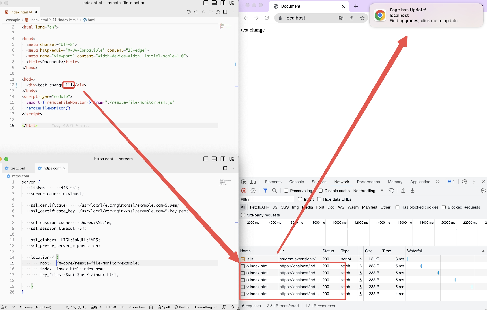

English | [简体中文](./README-zh.md)

## Example


## Remote file monitoring

This library is used to monitor whether the remote file has changed, and notify the user to refresh the page when it changes.

### Principle

By leveraging the browser's **cache negotiation** mechanism, this library utilizes a `Web Worker` to periodically poll the entry file. If an update is detected, it notifies the user through the `new Notification` feature.
### Install

Install the remote file monitoring library using npm:

```bash
npm install remote-file-monitor
```

### Instructions

First, import the required modules and interface definitions, **default configuration, out of the box**:

```typescript
import { remoteFileMonitor } from 'remote-file-monitor';

remoteFileMonitor()
```

### Custom parameter example

```typescript
import { remoteFileMonitor } from 'remote-file-monitor';

const config: WorkerConfig = {
   loopMs: 5000,
   checkFileUrl: 'https://example.com/index.html',
   enable: process.env.NODE_ENV !== 'development',
   clickCallback: () => {
     window.location.reload();
   },
   notification: {
     title: 'The page has been updated!',
     options: {
       dir: 'auto',
       body: 'Found a new update, please click to refresh the page',
       requireInteraction: true,
     },
   },
};

remoteFileMonitor(config);
```

This will check the remote file for changes at the specified interval and send a notification when it changes.

### configuration items

The following configuration items are available and their descriptions:

|Params|Default|Required|describe|
|---|---|---|--|
|loopMs|10000|No|The time interval in milliseconds for file checking|
|checkFileUrl|location.origin + /index.html|No|Defaults to the URL of the current page.|
|enable|true|No|Whether it is enabled|
|clickCallback|`() => location.reload()`|No|Click event|
|notification| - |No|The notification is window.notification|

### Precautions

- Remote file monitoring needs to run in a browser that supports Web Workers.
- If the browser does not support Web Workers, an error message will be output to the console.
- Please ensure that cross-origin access to remote files is properly configured.
- Remote file monitoring can only monitor files under the HTTPS protocol.
- If the user suppresses the notification notification, it becomes invalid.